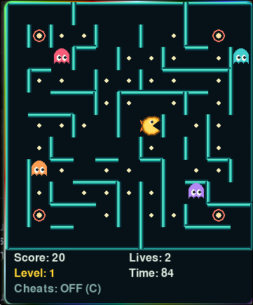
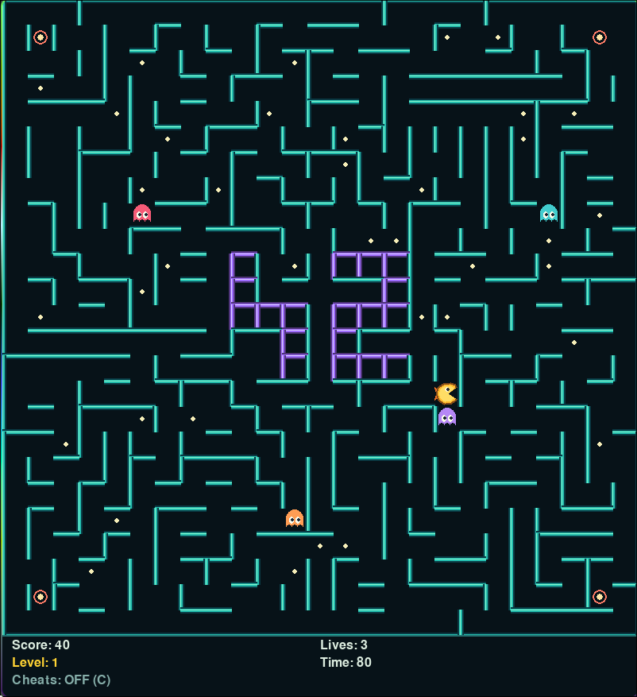
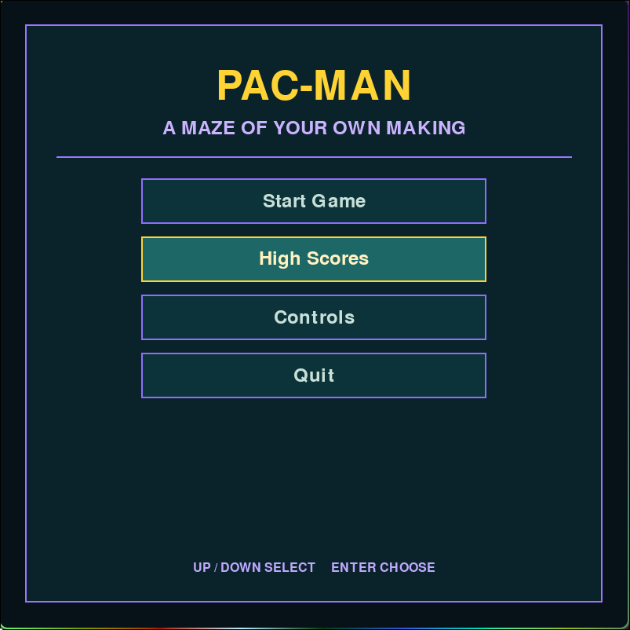
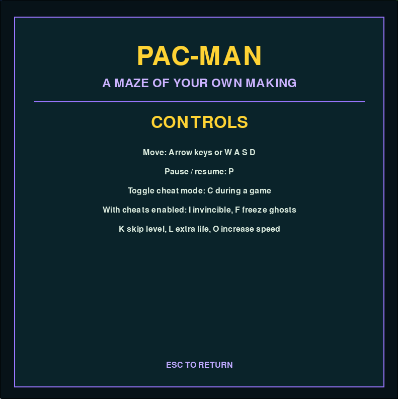
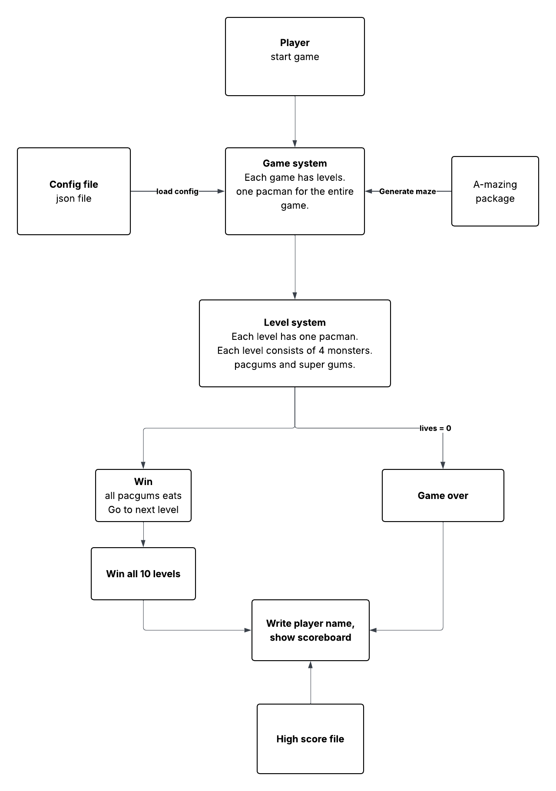
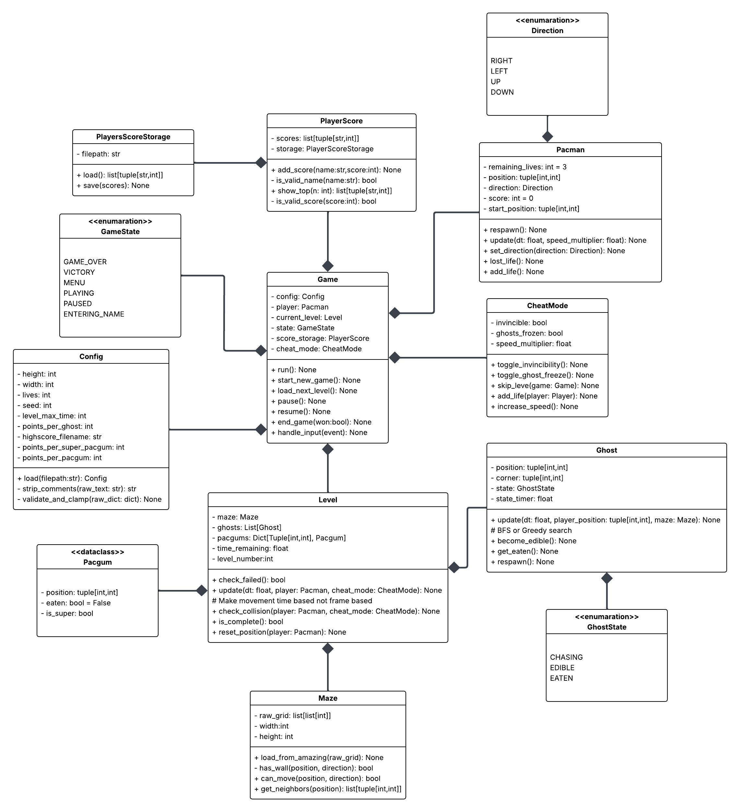

## Overview

* This is a simple pac-man game project made in python.
* The game will consist of multi levels 10 levels mainly.
* At the start of the game you will have 4 ghosts that will be at the corners and pacman at the middle.
* You must eat all the pacgums to go to the next level, and try to achieve maximum score possible.


## Game view










## Usage 

Run the game by:

```bash 
python3 pac-man.py config.json
```
`config.json`: Configurations you can change

Default screen size is set to 800x800, you can change it inside the code itself, maybe I will edit it later and add it as a configuration inside the json file.

```json
{
  # File name to save the highscore values in for each player (json format)
  "highscore_filename": "test.txt" ,


  # Pacman number of lives 
  "lives": 3,

  # The number of pacgums in the maze.
  # If it more than the maze size, the max the maze could take will be chosen
  "pacgum": 42,

  "points_per_pacgum": 10,
  
  "points_per_super_pacgum":50,

  "points_per_ghost":200,

  # Fixed maze generation, must be > 0
  "seed": 42,

  # Time for each level
  "level_max_time": 90,

  "level":[
        {"width": 25, "height": 25},
        {"width": 11, "height": 17},
        {"width": 17, "height": 17},
        {"width": 19, "height": 19},
        {"width": 19, "height": 19},
        {"width": 21, "height": 21},
        {"width": 21, "height": 21},
        {"width": 23, "height": 23},
        {"width": 23, "height": 23},
        {"width": 25, "height": 25},
        {"width": 25, "height": 25},
        {"width": 25, "height": 25},
        {"width": 25, "height": 25},
        {"width": 25, "height": 25}
  ]
}

```

## Algorithms used

Main algorithms used for ghosts:
  
  1) **BFS**: Ghosts chase pacman by finding the shortest path from their points to  pacman, and it is calculated for every cell moved.  
  2) **Flee algorithm**: When ghosts are in edible mode, they use the same bfs algorithm but this time when the path from every direction is calculated to find the shortest one, they chooses the most far one.

## System context diagram


## Class diagram 




